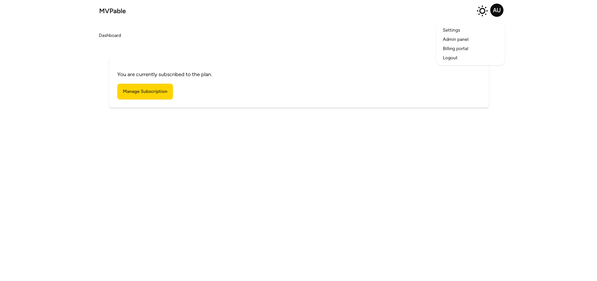
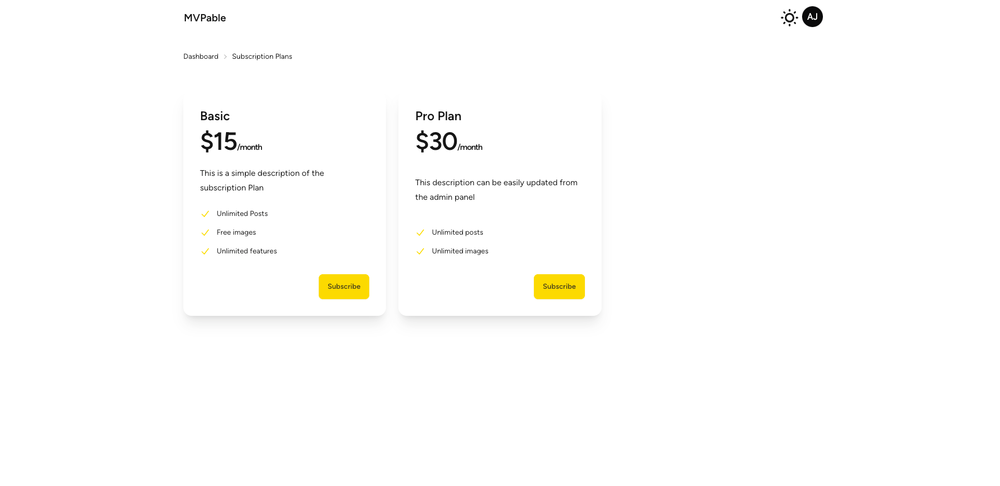
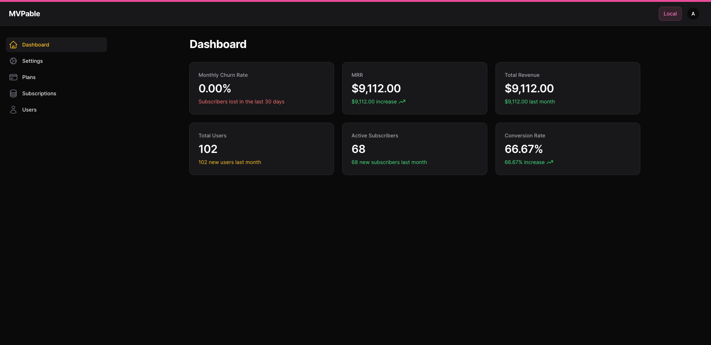
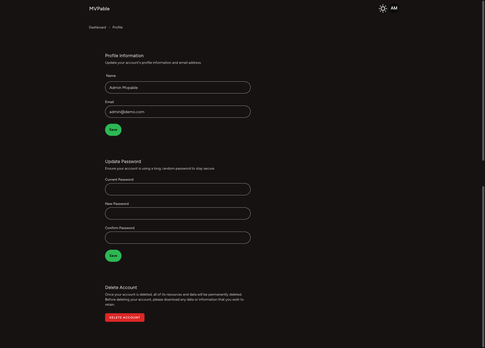

[](https://www.producthunt.com/posts/mvpable-free-complete-saas-boilerplate?embed=true&utm_source=badge-featured&utm_medium=badge&utm_souce=badge-mvpable-free-complete-saas-boilerplate)










# MVPable

MVPable is a comprehensive TALL (Tailwind CSS, Alpine.js, Laravel, Livewire) stack SaaS starter kit designed to accelerate the development of your SaaS products. With built-in features like Stripe checkout integration, user management, and a customizable admin panel, MVPable provides all the necessary components to launch your SaaS product quickly and efficiently.

## Features

### Admin Features

- **User Management**
  - User profiles and account settings
  - Activity logs

- **Subscription Management**
  - Stripe checkout integration
  - Subscription plans and billing cycles

- **General settings**
  - Manage application settings (site name, description, contact info)
  - Manage SEO settings (title, keywords, metadata)
  - Manage analytics settings (Google Analytics, HTML snippets)
  - File uploads for favicon and logo
  - Stripe configuration

- **Manage Plans**
  - brings your stripes plans to create pricing cards
  - Stripe configuration

- **UI/UX Enhancements**
  - Two ready themes: dark and light
  - 32 themes from DaisyUI
  - Easy custom theme setup

- **Security**

  - No disposable email (avoid spam and non-serious customers)

- **Development Tools**
  - CI/CD pipelines with GitHub Actions
  - One command setup

- **Analytics and Monitoring**
  -

### End User Features



- **Authentication and Authorization**
  - User registration, login, and password reset

- **UI/UX Enhancements**
  - Responsive design with Tailwind CSS & DaisyUI

- **Marketing and Customer Support**
  -

- **Miscellaneous**
  - SEO optimization tools
  - GDPR compliance tools

## Installation/Usage

### Prerequisites
- PHP 8.x
- Composer
- Node.js and npm
- MySQL or PostgreSQL
- Redis (optional, for caching)

### Installation
1. **Clone the repository:**
   ```bash
   git clone https://github.com/ismaelfi/mvpable.git
   cd mvpable
2. **Set up the development environment:**
   ```bash
   php artisan dev:setup


## Contributing
We welcome contributions to improve MVPable! Please fork the repository and submit a pull request with your changes.

## License
This project is open-source and available under the [MIT license](https://opensource.org/licenses/MIT).

## Acknowledgements
MVPable is inspired by various open-source projects and built with love by the community. Special thanks to the creators and maintainers of Tailwind CSS, Alpine.js, Laravel, and Livewire.

## Roadmap

- [ ] Create blog post with SEO
- [ ] Create free Landing page
- [ ] Improve documentation and tutorials
- [ ] Enhance the admin panel with more features
- [ ] Add support for more payment gateways (lemonsqueezy)
